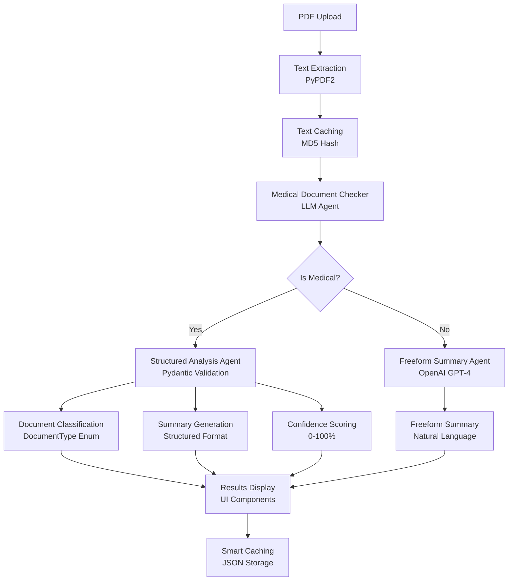
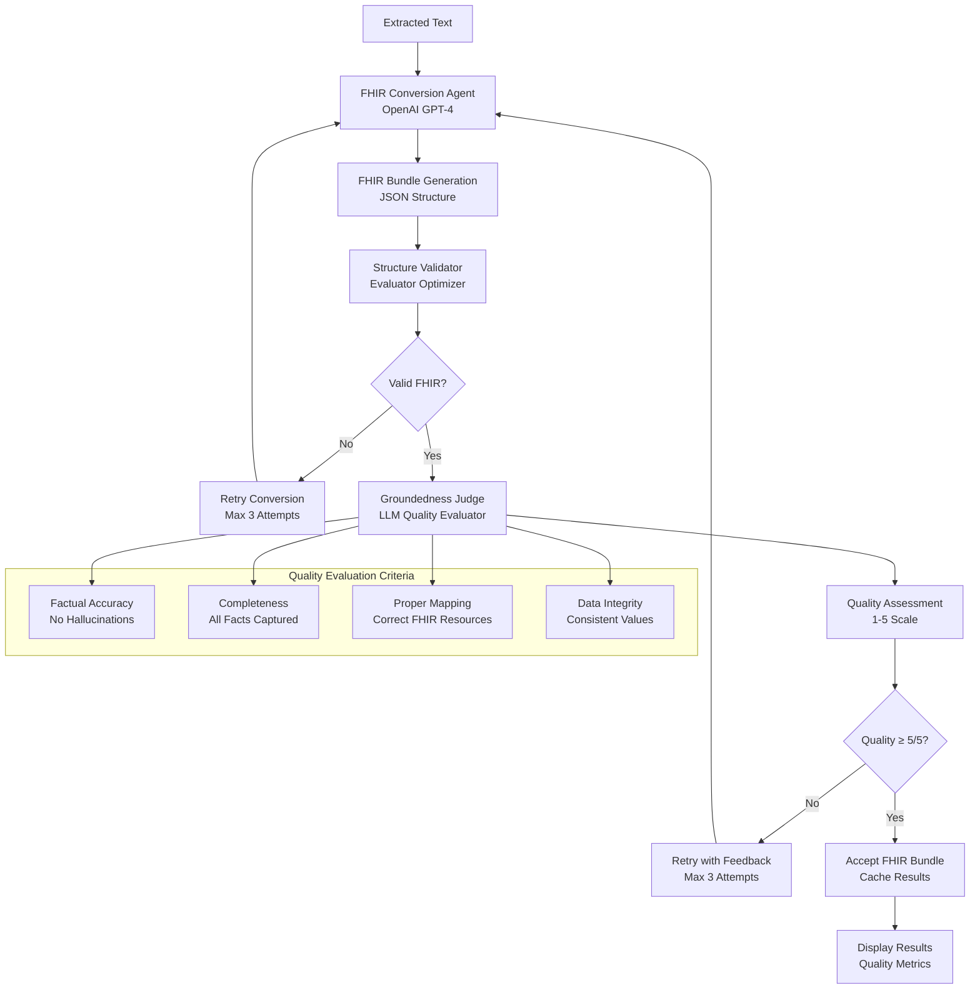

# AI Emblematic

A Flask web application for intelligent document processing with AI-powered analysis and FHIR conversion capabilities.

## Features

- **Document Upload**: PDF file upload and text extraction
- **AI Analysis**: OpenAI-powered document summarization and classification
- **FHIR Conversion**: Convert medical documents to FHIR format
- **Smart Caching**: Avoid re-processing the same documents
- **Bootstrap 5**: Modern, responsive UI components
- **Template Inheritance**: Consistent layout using Jinja2 templates
- **API Endpoints**: RESTful API for data interaction
- **Error Handling**: Comprehensive error handling and validation

## Project Structure

```
emblematic/
├── app.py                 # Main Flask application
├── models.py              # Pydantic models for AI analysis
├── keys.py                # API keys (not in version control)
├── keys_example.py        # Example API keys file
├── requirements.txt       # Python dependencies
├── README.md             # This file
├── .gitignore            # Git ignore file
├── templates/            # HTML templates
│   ├── base.html         # Base template
│   ├── index.html        # Home page
│   ├── about.html        # About page
│   └── text_display.html # Document display page
├── static/               # Static files
    ├── online-A-long-journey.png  # Background image
├── uploads/              # Uploaded files (not in version control)
└── text_cache/           # Cached text and analysis (not in version control)
    │   └── main.js       # JavaScript functionality
    └── images/           # Image assets
```

## Installation

1. **Clone or download** this project to your local machine

2. **Create a virtual environment** (recommended):
   ```bash
   python -m venv venv
   source venv/bin/activate  # On Windows: venv\Scripts\activate
   ```

3. **Install dependencies**:
   ```bash
   pip install -r requirements.txt
   ```

4. **Configure Azure OpenAI credentials**:
   - Copy `keys_example.py` to `keys.py`
   - Add your Azure OpenAI credentials to `keys.py`
   - **Important**: Never commit your actual API keys to version control!

## Azure OpenAI Configuration

The application uses Azure OpenAI for AI analysis and FHIR conversion features:

1. **Create `keys.py`**: Copy `keys_example.py` to `keys.py`
2. **Add your Azure credentials**: Replace the placeholder values with your actual Azure OpenAI credentials
3. **Security**: The `keys.py` file is automatically ignored by git to prevent accidental commits

Example `keys.py`:
```python
# Azure OpenAI Configuration
AZURE_OPENAI_API_KEY = "your_azure_openai_api_key_here"
AZURE_OPENAI_ENDPOINT = "https://your-resource-name.cognitiveservices.azure.com"
AZURE_OPENAI_API_VERSION = "2024-12-01-preview"
```

**Note**: Never commit your actual API keys to version control!

## System Architecture

### AI Agentic Processing Flow

The application uses a multi-agent architecture for document processing with specialized AI agents for different tasks:

#### Document Analysis & Summarization Flow



#### FHIR Conversion Flow with Quality Assurance



### Agent Descriptions

#### 1. **Medical Document Checker Agent**
- **Purpose**: Determines if a document contains medical information
- **Model**: OpenAI GPT-4
- **Input**: Raw extracted text
- **Output**: Binary classification (YES/NO)
- **Role**: Gatekeeper for structured vs. freeform processing

#### 2. **Structured Analysis Agent**
- **Purpose**: Performs comprehensive medical document analysis
- **Model**: OpenAI GPT-4 with Pydantic validation
- **Input**: Medical document text
- **Output**: Structured JSON with classification, summary, and confidence
- **Validation**: Pydantic models ensure data integrity
- **Retry Logic**: Up to 3 attempts for valid JSON structure

#### 3. **Freeform Summary Agent**
- **Purpose**: Generates natural language summaries for non-medical documents
- **Model**: OpenAI GPT-4
- **Input**: Non-medical document text
- **Output**: Human-readable summary
- **Flexibility**: No structural constraints, natural language output

#### 4. **FHIR Conversion Agent**
- **Purpose**: Converts medical documents to FHIR R4 Bundle format
- **Model**: OpenAI GPT-4
- **Input**: Medical document text
- **Output**: Valid FHIR Bundle JSON
- **Resources**: Patient, Practitioner, Observation, Condition, Medication, Procedure, Encounter, Organization
- **Standards**: FHIR R4 specification compliance

#### 5. **Structure Validator (Evaluator Optimizer)**
- **Purpose**: Validates FHIR Bundle structure and compliance
- **Method**: Rule-based validation engine
- **Checks**: 
  - Bundle resourceType and type
  - Entry structure and resource presence
  - Required fields per resource type
  - JSON structure integrity
- **Output**: Validation score (0-100%) with detailed error/warning lists

#### 6. **Groundedness Judge (LLM Quality Evaluator)**
- **Purpose**: Evaluates FHIR conversion quality against original text
- **Model**: OpenAI GPT-4
- **Evaluation Criteria**:
  - **Factual Accuracy**: No false information
  - **Completeness**: All relevant facts captured
  - **No Hallucination**: Only information from source
  - **Proper Mapping**: Correct FHIR resource mapping
  - **Data Integrity**: Consistent values and identifiers
- **Scoring**: 1-5 scale (5 = perfect, 1 = poor)
- **Retry Trigger**: Scores < 5/5 trigger conversion retry

### Quality Assurance Pipeline

The system implements a two-stage quality assurance process:

1. **Structure Validation**: Ensures FHIR format compliance
2. **Groundedness Evaluation**: Ensures content accuracy and completeness

Only conversions that pass both stages with perfect scores (5/5) are accepted as successful.

## Running the Application

1. **Start the Flask development server**:
   ```bash
   python app.py
   ```

2. **Open your browser** and navigate to:
   ```
   http://localhost:5000
   ```

## API Endpoints

### GET /api/hello
Returns a simple greeting message.

**Response:**
```json
{
  "message": "Hello from Flask!",
  "status": "success"
}
```

### POST /api/echo
Echoes back the JSON data sent in the request.

**Request Body:**
```json
{
  "message": "Hello",
  "data": "example"
}
```

**Response:**
```json
{
  "received": {
    "message": "Hello",
    "data": "example"
  },
  "message": "Data received successfully"
}
```

## Pages

- **Home** (`/`): Welcome page with feature overview and API testing
- **About** (`/about`): Information about the application and technologies used
- **404**: Custom page for not found errors
- **500**: Custom page for server errors

## Development

### Adding New Routes

Add new routes in `app.py`:

```python
@app.route('/new-page')
def new_page():
    return render_template('new_page.html')
```

### Adding New Templates

1. Create a new HTML file in the `templates/` directory
2. Extend the base template:
   ```html
   
   
   New Page - Flask App
   
   
   <h1>New Page Content</h1>
   
   ```

### Adding Static Files

- **CSS**: Add styles to `static/css/style.css`
- **JavaScript**: Add scripts to `static/js/main.js`
- **Images**: Place images in `static/images/`

## Configuration

The app uses the following configuration:
- **Debug Mode**: Enabled for development
- **Host**: `0.0.0.0` (accessible from any IP)
- **Port**: `5000`
- **Secret Key**: Set via environment variable `SECRET_KEY` or defaults to development key

## Production Deployment

For production deployment:

1. Set the `SECRET_KEY` environment variable
2. Set `FLASK_ENV=production`
3. Use a production WSGI server like Gunicorn
4. Configure a reverse proxy like Nginx

## License

This project is open source and available under the MIT License.
