# AI Emblematic

A Flask web application for intelligent document processing with AI-powered analysis and FHIR conversion capabilities.

## Features

- **Document Upload**: PDF file upload and text extraction
- **AI Analysis**: OpenAI-powered document summarization and classification
- **Insurance Underwriting**: Comprehensive health information extraction for insurance risk assessment
- **FHIR Conversion**: Convert medical documents to FHIR format with confidence scoring
- **Patient Email Generator**: Interactive chat interface for creating professional patient letters
- **Smart Caching**: Avoid re-processing the same documents
- **Modular Architecture**: Clean separation of concerns with dedicated service layers
- **Best Score Tracking**: Returns the highest quality result from multiple AI attempts
- **Feedback Learning**: AI agents learn from previous attempts to improve results
- **Bootstrap 5**: Modern, responsive UI components
- **Template Inheritance**: Consistent layout using Jinja2 templates
- **API Endpoints**: RESTful API for data interaction
- **Error Handling**: Comprehensive error handling and validation

## Project Structure

```
emblematic/
├── app.py                 # Main Flask application (CURRENT MAIN FILE)
├── keys.py                # API keys (not in version control)
├── keys_example.py        # Example API keys file
├── requirements.txt       # Python dependencies
├── README.md             # This file
├── .gitignore            # Git ignore file
├── src/                  # Source code (Flask best practices structure)
│   ├── __init__.py       # Python package initialization
│   ├── utils.py          # Utility functions (file handling, caching, etc.)
│   ├── config/           # Configuration management
│   │   ├── __init__.py   # Package initialization
│   │   └── config.py     # Application configuration and settings
│   ├── models/           # Data models and schemas
│   │   ├── __init__.py   # Package initialization
│   │   └── models.py     # Pydantic models for AI analysis and insurance underwriting
│   ├── services/         # Business logic and external API integrations
│   │   ├── __init__.py   # Package initialization
│   │   ├── ai_services.py         # AI/OpenAI service layer
│   │   ├── fhir_services.py       # FHIR conversion and validation services
│   │   └── patient_email.py       # Patient email generation and chat interface
│   └── routes/           # Flask route handlers
│       ├── __init__.py   # Package initialization
│       └── routes.py     # HTTP request/response handling
├── backup/               # Archived and backup files
│   ├── app_original.py   # Original monolithic app (backup)
│   ├── app_new.py        # Development version (backup)
│   └── MODULARIZATION_SUMMARY.md  # Development notes
├── docs/                 # Documentation and sample files
│   ├── pil.11811.pdf     # Sample document for testing
│   ├── pil12112.pdf      # Sample document for testing
│   ├── test_insurance_sample.txt  # Sample insurance document
│   └── env_example.txt   # Environment variables example
├── templates/            # HTML templates (Flask convention)
│   ├── base.html         # Base template with consistent styling
│   ├── index.html        # Home page with document upload
│   ├── about.html        # About page
│   ├── text_display.html # Document analysis and results page
│   ├── patient_email.html # Patient email chat interface
│   ├── fhir_logs.html    # FHIR conversion logs page
│   ├── 404.html          # 404 error page
│   └── 500.html          # 500 error page
├── static/               # Static files (Flask convention)
│   ├── css/
│   │   └── style.css     # Custom styles
│   ├── js/
│   │   └── main.js       # JavaScript functionality
│   ├── images/           # Image assets
│   ├── bupa.png          # Favicon and logo
│   └── online-A-long-journey.png  # Hero background image
├── uploads/              # Uploaded files (not in version control)
└── text_cache/           # Cached text and analysis (not in version control)
```

## Patient Email Generator

The Patient Email Generator is a comprehensive chat-based interface that helps doctors create professional patient letters through a structured conversation flow.

### Features

- **Interactive Chat Interface**: User-friendly chat interface for collecting patient information
- **Structured Question Flow**: Systematic collection of essential information:
  - Patient's full name
  - Doctor's practice name and location
  - Medical reason for medication
  - Detailed medication instructions
  - Additional notes and concerns
- **AI-Powered Letter Generation**: Professional patient letters generated using GPT-4
- **Document Context Integration**: Uses uploaded document content for enhanced letter generation
- **Copy-to-Clipboard**: Easy copying of generated letters for use in medical records
- **Real-time Status Updates**: Visual indicators showing progress through the conversation

### File: `patient_email.py`

This module contains:

- **`PatientEmailService`**: Main service class handling chat flow and letter generation
- **`PatientInfo`**: Pydantic model for patient information validation
- **`ChatMessage`**: Model for chat message structure
- **Question Flow Management**: Structured conversation with validation
- **AI Integration**: OpenAI GPT-4 integration for letter generation

### Usage

1. Upload a medical document
2. Click the "📧 Patient Email" button
3. Follow the interactive chat to provide patient information
4. Generate and copy the professional patient letter

### API Endpoints

- `GET /patient-email/<file_hash>`: Patient email chat interface
- `POST /api/patient-email/start-chat`: Initialize chat session
- `POST /api/patient-email/chat`: Process chat responses
- `POST /api/patient-email/generate-letter`: Generate patient letter

## Insurance Underwriting Analysis

The system includes comprehensive insurance underwriting capabilities with detailed health information extraction.

### Features

- **Automatic Detection**: AI identifies insurance underwriting documents
- **Comprehensive Health Data**: Extracts pre-existing conditions, medications, family history, lab results
- **Risk Assessment**: AI-powered risk level determination and recommendations
- **Professional Display**: Insurance industry-standard presentation
- **Pydantic Validation**: Structured data models for all health information

### Models in `models.py`

- **`InsuranceUnderwritingData`**: Comprehensive health information model
- **`PreExistingCondition`**: Detailed condition tracking with ICD-10 codes
- **`VitalSigns`**: Complete physiological measurements
- **`LabResult`**: Laboratory test results with reference ranges
- **`Medication`**: Detailed medication profiles
- **`FamilyHistory`**: Family medical background
- **`LifestyleFactors`**: Health behaviors and risk factors

## Modular Architecture

The application follows a clean, modular architecture with separation of concerns:

### Core Components

- **`config.py`**: Centralized configuration management
  - Handles environment variables and API keys
  - Manages directory creation and validation
  - Provides configuration objects to other modules

- **`utils.py`**: Utility functions and file operations
  - PDF text extraction with fallback methods
  - File hashing and caching operations
  - Session data management
  - File validation and security

- **`ai_services.py`**: AI/OpenAI service layer
  - Document analysis and classification
  - Medical document detection
  - Structured and freeform analysis
  - Azure OpenAI client management

- **`fhir_services.py`**: FHIR conversion and validation
  - Medical document to FHIR conversion
  - Multi-attempt processing with best score tracking
  - Groundedness evaluation using LLM judges
  - FHIR Bundle structure validation
  - Feedback learning between attempts

- **`routes.py`**: Flask route handlers
  - HTTP request/response handling
  - File upload processing
  - API endpoint management
  - Error handling and user feedback

- **`app.py`**: Main application entry point
  - Application factory pattern
  - Service initialization
  - Development server configuration

### Benefits of Modular Design

- **Maintainability**: Each module has a single responsibility
- **Testability**: Components can be tested in isolation
- **Reusability**: Services can be reused across different contexts
- **Scalability**: Easy to extend with new features
- **Debugging**: Issues can be traced to specific modules

## File Usage Guide

### Current Active Files

- **`app.py`**: ✅ **CURRENT MAIN FILE** - Use this to run the application (Flask factory pattern)

### Flask Best Practices Structure (`src/` folder)

- **`src/config/config.py`**: ⚙️ Configuration management and settings
- **`src/utils.py`**: 🔧 Utility functions and helpers
- **`src/models/models.py`**: 📋 Pydantic models for data validation
- **`src/services/`**: 🏗️ Business logic and external API integrations
  - `ai_services.py`: 🤖 AI analysis and insurance underwriting services
  - `fhir_services.py`: 🏥 FHIR conversion and validation services
  - `patient_email.py`: 📧 Patient email generation and chat interface
- **`src/routes/routes.py`**: 🌐 Flask route handlers and API endpoints

### Organized Files

- **`backup/`**: 📁 Contains archived versions and development notes
  - `app_original.py`: Original monolithic version (for reference)
  - `app_new.py`: Development version (backup)
  - `MODULARIZATION_SUMMARY.md`: Development documentation
- **`docs/`**: 📚 Sample documents and configuration examples
  - Sample PDF files for testing
  - Insurance document samples
  - Environment configuration examples

### How to Run

```bash
# Use the current modular version (RECOMMENDED)
python app.py
```

The application will start on `http://127.0.0.1:5001`

### Development vs Production

- **Development**: Use `app.py` (current modular architecture)
- **Production**: Consider using a WSGI server like Gunicorn with `app.py`

### File Organization

The project follows a clean structure with organized folders:

- **Root Level**: Contains only essential, active Python files
- **`backup/`**: Archive folder for old versions and development notes
- **`docs/`**: Sample documents, examples, and documentation files
- **`templates/`**: HTML templates with consistent styling and structure
- **`static/`**: Frontend assets (CSS, JavaScript, images) organized by type

This organization ensures a clean development environment while preserving historical files for reference.

## Flask Best Practices Structure

The application follows Flask best practices with a well-organized `src/` directory structure:

### Benefits of This Structure

- **🏗️ Separation of Concerns**: Each directory has a specific responsibility
- **📦 Package Organization**: Proper Python package structure with `__init__.py` files
- **🔄 Import Management**: Clean import statements following Python conventions
- **📈 Scalability**: Easy to add new services, models, or routes
- **🧪 Testability**: Structure supports easy unit testing
- **👥 Team Development**: Clear organization for multiple developers

### Directory Purposes

- **`src/config/`**: Application configuration, environment variables, settings
- **`src/models/`**: Data models, Pydantic schemas, database models
- **`src/services/`**: Business logic, external API integrations, core functionality
- **`src/routes/`**: HTTP route handlers, request/response processing
- **`src/utils.py`**: Shared utility functions used across modules

### Import Convention

The new structure uses explicit imports:
```python
# Example imports in the new structure
from src.config.config import config
from src.services.ai_services import AIService
from src.models.models import DocumentAnalysis
```

This follows Python best practices and makes dependencies clear.

## Installation

1. **Clone or download** this project to your local machine

2. **Create a virtual environment** (recommended):
   ```bash
   python -m venv venv
   source venv/bin/activate  # On Windows: venv\Scripts\activate
   ```

3. **Install dependencies**:
   ```bash
   pip install -r requirements.txt
   ```

4. **Configure Azure OpenAI credentials**:
   - Copy `keys_example.py` to `keys.py`
   - Add your Azure OpenAI credentials to `keys.py`
   - **Important**: Never commit your actual API keys to version control!

## Azure OpenAI Configuration

The application uses Azure OpenAI for AI analysis and FHIR conversion features:

1. **Create `keys.py`**: Copy `keys_example.py` to `keys.py`
2. **Add your Azure credentials**: Replace the placeholder values with your actual Azure OpenAI credentials
3. **Security**: The `keys.py` file is automatically ignored by git to prevent accidental commits

Example `keys.py`:
```python
# Azure OpenAI Configuration
AZURE_OPENAI_API_KEY = "your_azure_openai_api_key_here"
AZURE_OPENAI_ENDPOINT = "https://your-resource-name.cognitiveservices.azure.com"
AZURE_OPENAI_API_VERSION = "2024-12-01-preview"
```

**Note**: Never commit your actual API keys to version control!

## System Architecture

### AI Agentic Processing Flow

The application uses a multi-agent architecture for document processing with specialized AI agents for different tasks:

#### Document Analysis & Summarization Flow


#### FHIR Conversion Flow with Quality Assurance

```mermaid
graph TD
    A[Extracted Text] --> B[FHIR Conversion Agent<br/>OpenAI GPT-4]
    B --> C[FHIR Bundle Generation<br/>JSON Structure]
    C --> D[Structure Validator<br/>Evaluator Optimizer]
    D --> E{Valid FHIR?}
    E -->|No| F[Retry Conversion<br/>Max 3 Attempts]
    F --> B
    E -->|Yes| G[Groundedness Judge<br/>LLM Quality Evaluator]
    G --> H[Quality Assessment<br/>1-5 Scale]
    H --> I{Quality ≥ 5/5?}
    I -->|No| J[Retry with Feedback<br/>Max 3 Attempts]
    J --> B
    I -->|Yes| K[Accept FHIR Bundle<br/>Cache Results]
    K --> L[Display Results<br/>Quality Metrics]
    
    subgraph "Quality Evaluation Criteria"
        M[Factual Accuracy<br/>No Hallucinations]
        N[Completeness<br/>All Facts Captured]
        O[Proper Mapping<br/>Correct FHIR Resources]
        P[Data Integrity<br/>Consistent Values]
    end
    
    G --> M
    G --> N
    G --> O
    G --> P
```



### Agent Descriptions

#### 1. **Medical Document Checker Agent**
- **Purpose**: Determines if a document contains medical information
- **Model**: OpenAI GPT-4
- **Input**: Raw extracted text
- **Output**: Binary classification (YES/NO)
- **Role**: Gatekeeper for structured vs. freeform processing

#### 2. **Structured Analysis Agent**
- **Purpose**: Performs comprehensive medical document analysis
- **Model**: OpenAI GPT-4 with Pydantic validation
- **Input**: Medical document text
- **Output**: Structured JSON with classification, summary, and confidence
- **Validation**: Pydantic models ensure data integrity
- **Retry Logic**: Up to 3 attempts for valid JSON structure

#### 3. **Freeform Summary Agent**
- **Purpose**: Generates natural language summaries for non-medical documents
- **Model**: OpenAI GPT-4
- **Input**: Non-medical document text
- **Output**: Human-readable summary
- **Flexibility**: No structural constraints, natural language output

#### 4. **FHIR Conversion Agent**
- **Purpose**: Converts medical documents to FHIR R4 Bundle format
- **Model**: OpenAI GPT-4
- **Input**: Medical document text
- **Output**: Valid FHIR Bundle JSON
- **Resources**: Patient, Practitioner, Observation, Condition, Medication, Procedure, Encounter, Organization
- **Standards**: FHIR R4 specification compliance

#### 5. **Structure Validator (Evaluator Optimizer)**
- **Purpose**: Validates FHIR Bundle structure and compliance
- **Method**: Rule-based validation engine
- **Checks**: 
  - Bundle resourceType and type
  - Entry structure and resource presence
  - Required fields per resource type
  - JSON structure integrity
- **Output**: Validation score (0-100%) with detailed error/warning lists

#### 6. **Groundedness Judge (LLM Quality Evaluator)**
- **Purpose**: Evaluates FHIR conversion quality against original text
- **Model**: OpenAI GPT-4
- **Evaluation Criteria**:
  - **Factual Accuracy**: No false information
  - **Completeness**: All relevant facts captured
  - **No Hallucination**: Only information from source
  - **Proper Mapping**: Correct FHIR resource mapping
  - **Data Integrity**: Consistent values and identifiers
- **Scoring**: 1-5 scale (5 = perfect, 1 = poor)
- **Retry Trigger**: Scores < 5/5 trigger conversion retry

### Quality Assurance Pipeline

The system implements a two-stage quality assurance process:

1. **Structure Validation**: Ensures FHIR format compliance
2. **Groundedness Evaluation**: Ensures content accuracy and completeness

Only conversions that pass both stages with perfect scores (5/5) are accepted as successful.

## Running the Application

1. **Start the Flask development server**:
   ```bash
   python app.py
   ```

2. **Open your browser** and navigate to:
   ```
   http://127.0.0.1:5001
   ```

**Note**: The application runs on port **5001** by default to avoid conflicts with other services.

## API Endpoints

### GET /api/hello
Returns a simple greeting message.

**Response:**
```json
{
  "message": "Hello from Flask!",
  "status": "success"
}
```

### POST /api/echo
Echoes back the JSON data sent in the request.

**Request Body:**
```json
{
  "message": "Hello",
  "data": "example"
}
```

**Response:**
```json
{
  "received": {
    "message": "Hello",
    "data": "example"
  },
  "message": "Data received successfully"
}
```

## Pages

- **Home** (`/`): Welcome page with feature overview and API testing
- **About** (`/about`): Information about the application and technologies used
- **404**: Custom page for not found errors
- **500**: Custom page for server errors

## Development

### Adding New Routes

Add new routes in `app.py`:

```python
@app.route('/new-page')
def new_page():
    return render_template('new_page.html')
```

### Adding New Templates

1. Create a new HTML file in the `templates/` directory
2. Extend the base template:
   ```html
   
   
   New Page - Flask App
   
   
   <h1>New Page Content</h1>
   
   ```

### Adding Static Files

- **CSS**: Add styles to `static/css/style.css`
- **JavaScript**: Add scripts to `static/js/main.js`
- **Images**: Place images in `static/images/`

## Configuration

The app uses the following configuration:
- **Debug Mode**: Enabled for development
- **Host**: `0.0.0.0` (accessible from any IP)
- **Port**: `5001` (to avoid conflicts with other services)
- **Secret Key**: Set via environment variable `SECRET_KEY` or defaults to development key
- **Azure OpenAI**: Configured via `keys.py` with your Azure credentials

## Production Deployment

For production deployment:

1. Set the `SECRET_KEY` environment variable
2. Set `FLASK_ENV=production`
3. Use a production WSGI server like Gunicorn
4. Configure a reverse proxy like Nginx

## License

This project is open source and available under the MIT License.
